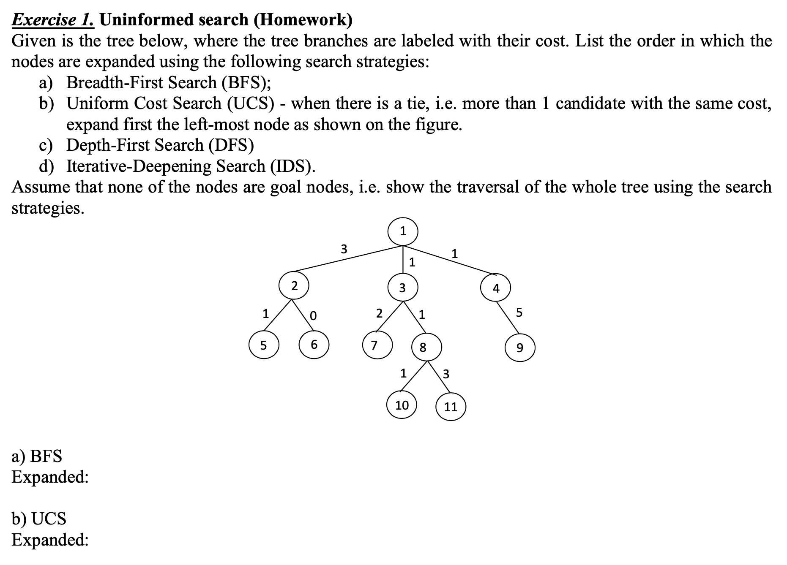
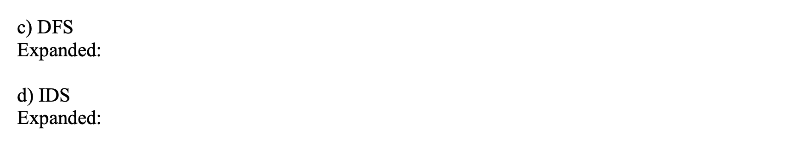
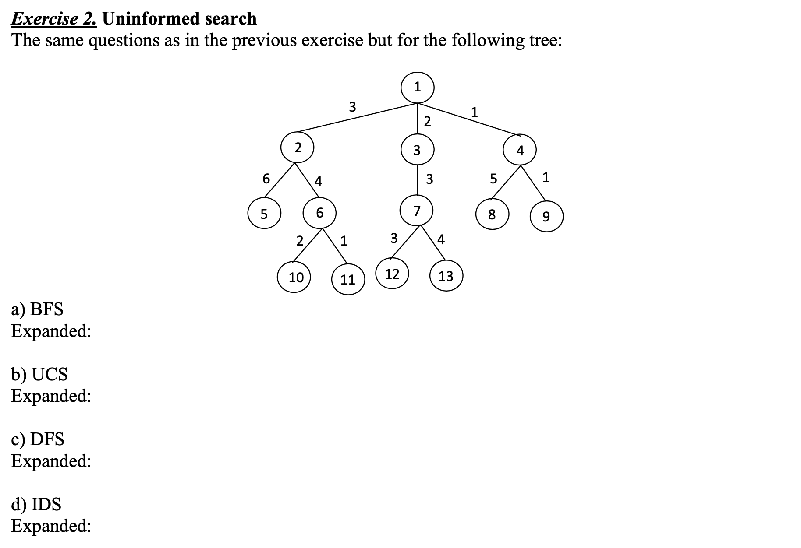
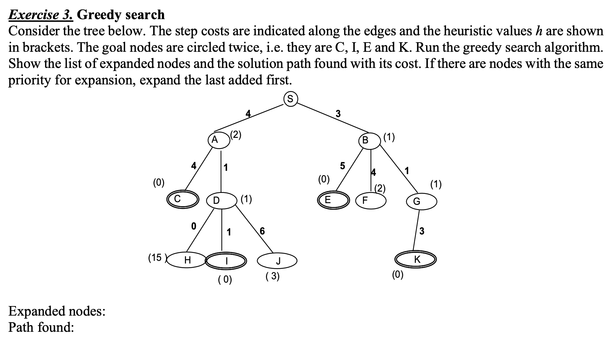
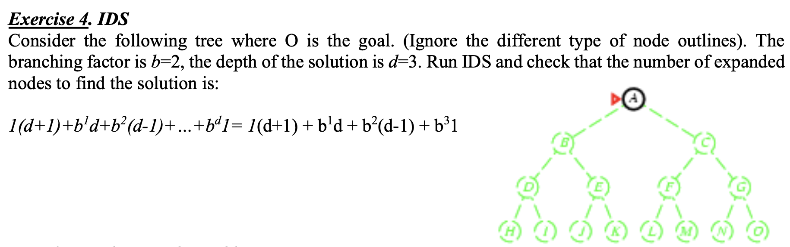
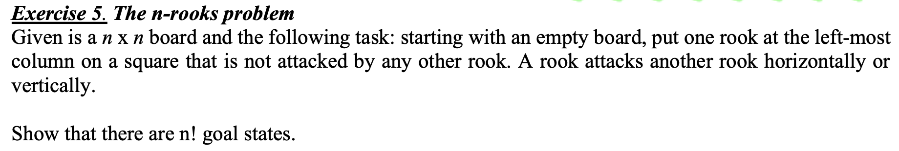
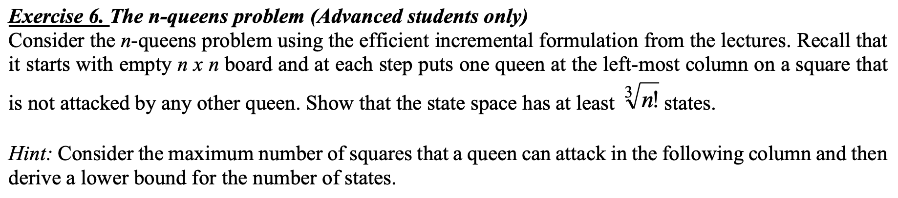
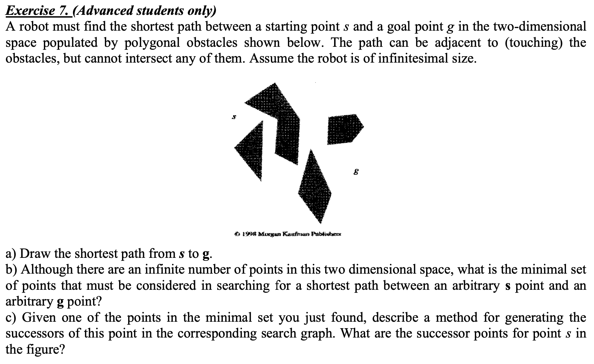
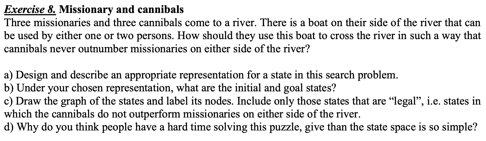
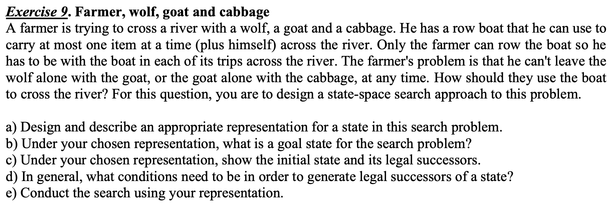

# COMP3308 2025S1 wk2 Tutorial

## Tutorial Topic

Search Problem Formulation. Uninformed Search. Informed Search: Greedy.

## Personal Detail

Name: Xiangyu Ding

SID: 490075410

## Q1 (Homework)

**Question:**

**Answer:**

- a. BFS Expanded: 1, 2, 3, 4, 5, 6, 7, 8, 9, 10, 11.
- b. UCS Expanded:
  - With cost been express in the format of (node_number, cost): (1, 0), (3, 1), (4,1), (8,2), (2,3), (6,3), (7,3), (10,3), (5, 4), (11,5), (9, 6).
  - Without expressing cost: 1, 3, 4, 8, 2, 6, 7, 10, 5, 11, 9.
- c. DFS Expanded: 1, 2, 5, 6, 3, 7, 8, 10, 11, 4, 9.
- d. IDS Expanded:
  - With level been shown:
    - (l = 0) 1;
    - (l = 1) 1, 2, 3, 4;
    - (l = 2) 1, 2, 5, 6, 3, 7, 8, 4, 9;
    - (l = 3) 1, 2, 5, 6, 3, 7, 8, 10, 11, 4, 9.
  - Without level been shown: 1, 1, 2, 3, 4, 1, 2, 5, 6, 3, 7, 8, 4, 9, 1, 2, 5, 6, 3, 7, 8, 10, 11, 4, 9.

## Q2

**Question:**

**Answer:**

- a. BFS Expanded: 1, 2, 3, 4, 5, 6, 7, 8, 9, 10, 11, 12, 13.
- b. UCS Expanded:
  - With cost been express in the format of (node_number, cost): (1, 0), (4, 1), (3,2) (9,2), (2,3), (7,5), (8,6), (6,7), (11,8),(12,8), (5, 9), (10,9), (13,9).
  - Without expressing cost: 1, 4, 3, 9, 2, 7, 8, 6, 11, 12, 5, 10, 13.
- c. DFS Expanded: 1, 2, 5, 6, 10, 11, 3, 7, 12, 13, 4, 8, 9.
- d. IDS Expanded:
  - With level been shown:
    - (l = 0) 1;
    - (l = 1) 1, 2, 3, 4;
    - (l = 2) 1, 2, 5, 6, 3, 7, 4, 8, 9;
    - (l = 3) 1, 2, 5, 6, 10, 11, 3, 7, 12, 13, 4, 8, 9.
  - Without level been shown: 1, 1, 2, 3, 4, 1, 2, 5, 6, 3, 7, 4, 8, 9, 1, 2, 5, 6, 10, 11, 3, 7, 12, 13, 4, 8, 9.

## Q3

**Question:**

**Answer:**

- Expanded nodes: S, B, E.
- Path found: S, B, E.
- Path cost: 8.

## Q4

**Question:**

**Answer:**

Thinking process:

- The number of expanded nodes in total while running IDS   = the sum of total repeating expanded times of each level's nodes
- The total repeating expanded times of a specific level's nodes   = the number of nodes in this level $\times$ this level's repeating expanded times in IDS
  - the number of nodes of each level, counting from level 0 (i.e. $l=0$) to level d (i.e. $l = depth = d$), is $b^l$ where $l$ is increasing from $0$ to $d$ and b itself is the branching factor (i.e. how many branches/children it has for each node).
  - the level's repeating expanded times in IDS of each level, from level $0$ to $d$, is decreasing from $d + 1$ to $1$.
  
Express the above thinking into mathematical formula, it will be:

$$
\sum_{l=0}^{d} b^l(d+1-l)
$$

## Q5

**Question:**

**Answer:**

- The rule is the rook can attacks another rook horizontally and vertically. Thus, in each goal state (each board layout without rook attacking each other), each column in the board layout can only be put one rook.
- For the left-most first column, since there is no other rook been put on the board, it can have n possible ways to put rook in that column.
- However, after puting 1 rook in the left-most first column, from the left-most second column, it can only have $n-1$ possible ways to put rook in that column to avoid attacking each other with the first rook has put in the first column.
- Similar appoarches for the remaining $n-2$ rooks into the remaining $n-2$ columns, the available ways to put rook to achieve goal nodes is decreasing from $n-2$ to $1$.

Therefore, there are $n \times (n-1) \times (n-2) \times ... \times 1 = n!$ goal states.

## Q6

**Question:**

**Answer:**

N/A

## Q7

**Question:**

**Answer:**

N/A

## Q8

**Question:**

**Answer:**

- a. Representation for a state in this search problem:
  - We named the initial side of river is X, the side aimed to go to is Y.
  - Because the total number of missionaries and the total number of cannibals are both fixed at 3, it is not needed to count their numbers on both side, one side is enough. Thus, we use two integers to express the number of missionaries and cannibals in the initial side X.
  - We need to express where the boat is to determine what kind of operations we can do in the next step.
  
  Therefore, the representation can be:   (Number of missionaries in X side, Number of cannibals in X side, Boat-located side).

- b. Under the chosen representation,
  - the initial state is $(3,3,X)$;
  - the goal state is $(0,0,Y)$.

- c. Graph of the states and label its nodes, including only “legal” states that cannibals do not outperform missionaries on either side of the river:

- d. Why do you think people have a hard time solving this puzzle, give than the state space is so simple?

## Q9

**Question:**

**Answer:**

- a. Representation for a state in this search problem:

- b. Under the chosen representation,

- c. Under the chosen representation,

- d. In general,

- e. Search conduct using